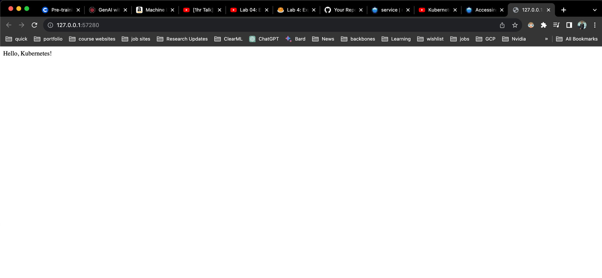

# Steps

## Minikube

Install

```yaml
brew install minikube
which minikube
```

Create cluster

```yaml
minikube start
minikube start --driver docker
```

## Create sample app

```
pip install pip-tools
pip install flask
```

`app.py`

```python
# app.py
from flask import Flask

app = Flask(__name__)

@app.route("/")
def hello():
    return "Hello, Kubernetes!"

if __name__ == "__main__":
    app.run(debug=True, host="0.0.0.0", port="8081")
```

## Containerize

Create `requirements.in`

```python
flask
```

get `requirements.txt`

```python
pip-compile
```

`Dockerfile`

```docker
FROM python:3.11-slim

WORKDIR /app

COPY requirements.txt requirements.txt
RUN pip install -r requirements.txt

COPY . .

EXPOSE 8081

CMD ["python", "app.py"]
```

Build the image

```
docker build -t pytholic/flaskapp:test .
```

Test the image

```
docker run -p 8081:8081 pytholic/flaskapp:test
```

## Kubernetes Deployment

Put the image to Minikube registry

[Ref link](https://minikube.sigs.k8s.io/docs/handbook/pushing/)

```
minikube image load pytholic/flaskapp:test
minikube image ls
```

`app.yaml`

```yaml
apiVersion: apps/v1
kind: Deployment
metadata:
  name: flask-deployment
  labels:
    app: flaskapp
spec:
  replicas: 1
  selector:
    matchLabels:
      app: flaskapp
  template:
    metadata:
      labels:
        app: flaskapp
    spec:
      containers:
        - name: flaskapp
          image: pytholic/flaskapp:local
          ports:
            - containerPort: 8081
          imagePullPolicy: IfNotPresent

---
apiVersion: v1
kind: Service
metadata:
  name: flaskapp-service
spec:
  type: NodePort
  selector:
    app: flaskapp
  ports:
    - protocol: TCP
      port: 8081
      targetPort: 8081
      nodePort: 30001
```

Deploy

```
❯ kubectl apply -f app.yaml                                                                       ─╯
deployment.apps/flask-deployment created
service/flaskapp-service created
```

```
❯ kubectl get pods                                                                                    ─╯
NAME                                READY   STATUS    RESTARTS   AGE
flask-deployment-6548b758cb-wpvvq   1/1     Running   0          28m
```

```
minikube dashboard
```

## Accessing the app

### If using Minikube with docker

<aside>
💡 It will create a tunnel on Mac.

</aside>

https://minikube.sigs.k8s.io/docs/handbook/accessing/#nodeport-access

```
minikube service --all
minikube service <service-name> --url
```

```
minikube service flaskapp-service --url
```

Keep it open in a terminal. It changes every time.

Open in browser.

### If using normal Minikube

Get the address

```
kubectl get services/svc

kubectl get node -o wide
or
minikube ip                                                                                     ─╯
```

Note the `INTERNAL-IP` and combine with `port` from service.

